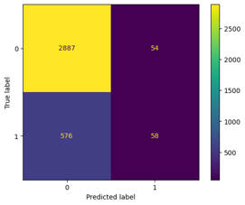
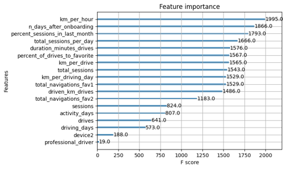

**<h1 style="text-align: left;"></h1>**
**<h1 style="text-align: center;"> Waze Project</h1>**

## Contents
- [Contents](#contents)
- [Background](#background)
- [Statistical Testing](#statistical-testing)
    - [*Overview*](#overview)
    - [*Objective*](#objective)
    - [*Results*](#results)
    - [*Next Steps*](#next-steps)
- [Binomial Logistic Regression](#binomial-logistic-regression)
    - [*Overview*](#overview-1)
    - [*Project Status*](#project-status)
    - [*Key Insights*](#key-insights)
    - [*Next steps*](#next-steps-1)
- [Machine Learning : Classification](#machine-learning--classification)
    - [*Overview*](#overview-2)
    - [*Response Methadology*](#response-methadology)
    - [*Impact*](#impact)
    - [*Key Insights*](#key-insights-1)
- [Author](#author)
## Background
This project is part of the Google Advanced Data Analytics(GADA) professional certificate program. In this program created scenario I am working for Waze Mobile Ltd, which is a subsidiary company of Google that provides satellite navigation software on smartphones and other computers that support the Global Positioning System. This project is part of a larger effort at Waze to increase growth. Typically, high retention rates indicate satisfied users who repeatedly use the Waze app over time. Developing a churn prediction model will help prevent churn, improve user retention, and grow Waze’s business. As previous projects of this course it is also divided in to three main parts.Firstly, statistical testes to determine whether there is a difference in users churning rate by models of android & Iphone users. Secondly, A binomial logistic regression model waas build to predict whether a user would churn or not. Finally, final machine learning classification models were trained, validated and then the champion model was tested.

####### ~~~~~~~~~~~~~~~~~~~~~~~~~~~~~~~~~~~~~~~~~~~~~~~~~~~~~~~~~~~~~~~ #######

## Statistical Testing
#### *Overview*

The Waze data team is currently developing a data analytics project aimed at increasing overall growth by preventing monthly user churn on the Waze app. 
As part of the effort to improve retention, Waze wants to learn more about users’ behavior. This report offers information on the project status and results of Milestone 4, which impact the future development of the overall project.  

#### *Objective*

- *Target Goal* - Develop a two-sample hypothesis test to analyze and determine whether there is a statistically significant difference between mean number of rides and device type – Android vs. iPhone.
- *Impact* - Statistical tests, such as the one conducted for Milestone 4, enable the Waze data team to make inferences about the populations from which the data was drawn and help them learn more about their user base.

#### *Results*

- Based on the calculations, drivers who use an iPhone to interact with the application have a higher number of drives on average.
- The t-test results concluded there is not a statistically significant difference in mean number of rides between iPhone users and Android users. 
  
#### *Next Steps*

- Due to the results rendered from this specific hypothesis test, the Waze data team recommends running additional t-tests on other variables to learn more about user behavior.
- Additionally, since the user experience is the same, temporary changes in marketing or user interface may be impactful rendering more data to investigate user churn behavior. 

####### ~~~~~~~~~~~~~~~~~~~~~~~~~~~~~~~~~~~~~~~~~~~~~~~~~~~~~~~~~~~~~~~ #######

## Binomial Logistic Regression
#### *Overview*

The Waze data team is currently developing a data analytics project aimed at increasing overall growth by preventing monthly user churn on the Waze app. For the purposes of this project, churn quantifies the number of users who have uninstalled the Waze app or stopped using the app. Binomial logistic regression models typically offer flexibility and predictive power, which can be used to inform larger business decisions. Our team sought to build one from the data provided for this project. This report offers details and key insights from Milestone 5, which impact the future development of the overall project. 

#### *Project Status*

- *Target Goal* - Apply user data to build and analyze a binomial logistic regression model.
- *Methods* - 
    * Created features of interest to the stakeholders and business scenario.
    * Assessed features for multicollinearity.
    * Built the regression model.
    * Evaluated model performance 

- *Impact* -  With enough data, binomial logistic regression model results can reveal important variable relationships and predict binary outcomes, which can inform decisions for marketing and product development, for example. 

 
#### *Key Insights*

*Note: 1=Churned 0=Retained*

- The efficacy of a binomial logistic regression model is determined by accuracy, precision, and recall scores; in particular, recall is essential to this model as it shows the number of churned users.
- The model has mediocre precision (53% of its positive predictions are correct) but very low recall, with only 9% of churned users identified. This means the model makes a lot of false negative predictions and fails to capture users who will churn.
- Activity_days was by far the most important feature in the model. It had a negative correlation with user churn. 
- In previous EDA, user churn rate increased as the values in km_per_driving_day increased. In the model, distance driven per day was the second-least-important variable.

 
#### *Next steps*
- Due to the model results, I recommend using the key insights from this project milestone to guide further exploration.
- This model should not be used to make significant business decisions; however, it has valuable insights insofar as it demonstrated a great need for additional data (features) that correlates with user churn, and also a possible need to better define the user profile Waze seeks to target in their aim to increase overall growth by preventing monthly user churn on the app. 
 

####### ~~~~~~~~~~~~~~~~~~~~~~~~~~~~~~~~~~~~~~~~~~~~~~~~~~~~~~~~~~~~~~~ #######

## Machine Learning : Classification
#### *Overview*
The Waze data team is currently developing a data analytics project aimed at increasing overall growth by preventing monthly user churn on the Waze app. For the purposes of this project, churn quantifies the number of users who have uninstalled the Waze app or stopped using the app. The ultimate goal for this project is to develop a machine learning (ML) model that predicts user churn. This report offers details and key insights from Milestone 6, which could impact the future development of the project, should further work be undertaken. 

#### *Response Methadology*
- To obtain a model with the highest predictive power, I developed two different models to cross-compare results: random forest and XGBoost.
- To prepare for this work, the data was split into training, validation, and test sets. Splitting the data three ways means that there is less data available to train the model than splitting just two ways. However, performing model selection on a separate validation set enables testing of the champion model by itself on the test set, which gives a better estimate of future performance than splitting the data two ways and selecting a champion model by performance on the test data. 

#### *Impact*
- The ML models developed for Milestone 6 demonstrate a critical need for additional data in order to more accurately predict user churn. 
- This modeling effort confirms that the current data is insufficient to consistently predict churn. It would be helpful to have drive-level information for each user (such as drive times, geographic locations, etc.). It would probably also be helpful to have more granular data to know how users interact with the app. For example, how often do they report or confirm road hazard alerts? Finally, it could be helpful to know the monthly count of unique starting and ending locations each driver inputs. 
- Since engineered features are a proven valuable tool for improving the performance of ML models, the Waze team recommends a second iteration of the User Churn Project.

#### *Key Insights*

- Engineered features accounted for six of the top 10 features: km_per_hour, percent_sessions_in_last_month, total_sessions_per_day, percent_of_drives_to_favorite, km_per_drive, km_per_driving_day.
- The XGBoost model fit the data better than the random forest model. Additionally, it’s important to call out that the recall score (17%) is nearly double the score from the previous logistic regression model built in Milestone 5, while still maintaining a similar accuracy and precision score. 
- The ensembles of tree-based models in this project milestone are more valuable than a singular logistic regression model because they achieve higher scores across all evaluation metrics and require less preprocessing of the data. However, it is more difficult to understand how they make their predictions.

####### ~~~~~~~~~~~~~~~~~~~~~~~~~~~~~~~~~~~~~~~~~~~~~~~~~~~~~~~~~~~~~~~ #######

## Author
>**Muhammad Umair Salim**
\
Data Science Certifications
>- IBM Data Science Professional Certificate
>- Google Advanced Data Analytics Professional Certificate
>- UoA Faislabad Data Science Professional Certificate
>- UoM Statistics with Python Specialization
\
[Email](umairsalim@datistan.onmicrosoft.com)
\
[Kaggle](https://www.kaggle.com/umairsalim219)
\
[LinkedIn](https://www.linkedin.com/in/muhammad-umair-salim-a0401a256/)
\
[GitHub](https://github.com/Umair-Salim)
\
[Twitter](https://twitter.com/UmairSalim5)

